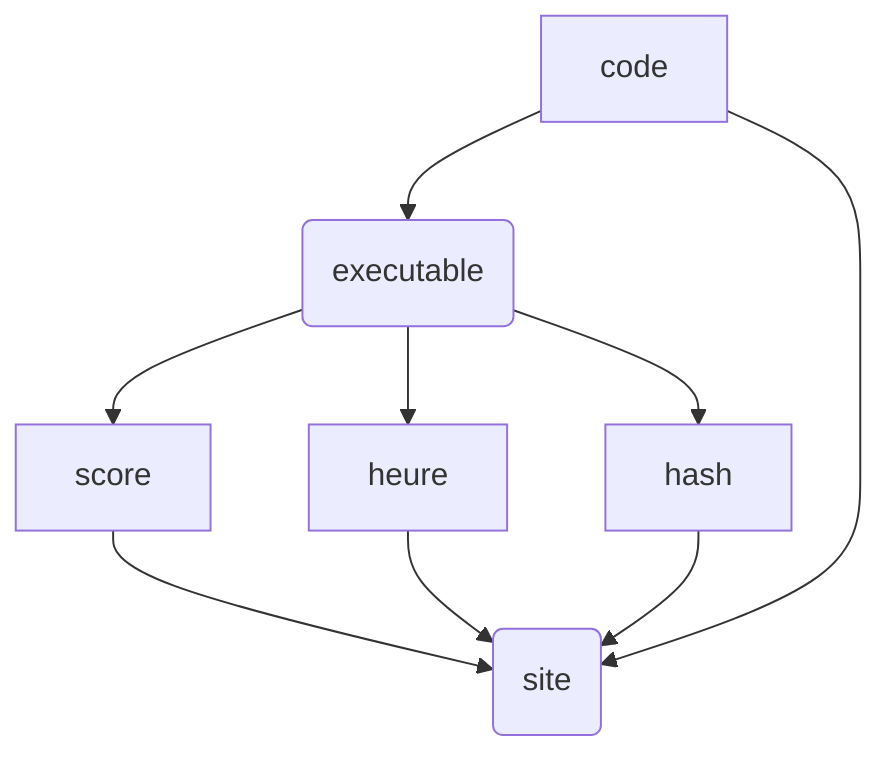
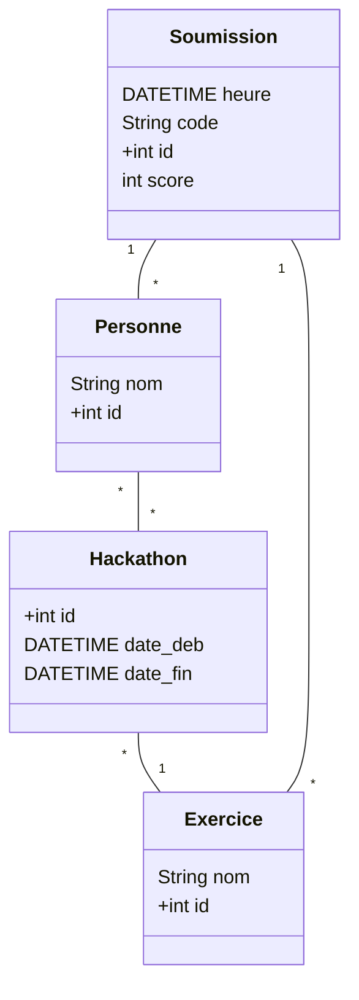

# Recherches sur comment faire un site pour des hackathons

## Sommaire

- I) Choix de design
- II) Architecture

## I) Choix de design

### 1.1- Types de hackathons

Voici une liste de types d'hackathons possibles :

- Liste d'exercices où il faut envoyer le résultat (exemple : adventofcode.com)
- Liste d'exercices, mais avec une interface graphique (exemple : codingame.com)
- Tournois, avec un système d'élo (exemple: codingame.com)

### 1.2- Exécuter du code sur le serveur ou chez le client ?

Exécuter du code sur le serveur permettrait d'avoir une plus grande liberté d'actions. Les 3 types d'hackathons seraient faisables avec ce genre de site. Mais cela pose énormément de problèmes de sécurité. On mettra en appendice des idées pour permettre cela. Mais pour l'instant, on exécutera le code **chez le client**. Cela n'est pas extrêmement contraignant, car sauf les hackathons tournois, tout reste faisable.

### 1.3- Description du fonctionnement

L'utilisateur va télécharger *(l'exécutable/programme python)* fait préalablement par les admins du hackathon. Ce programme va prendre en entrée un code, et va en retour donner le score, l'heure d'exécution, et l'haché de l'heure, du code, et du score. L'utilisateur pourra alors rentrer tout cela sur le site, qui va, si l'haché est correct, rentrer ça dans le leaderboard. L'utilisateur devra aussi se connecter au site avant de pouvoir rentrer sa soumission.

### 1.4- Choix des langages

Le but principal du projet est de pouvoir fournir un site qui puisse rester dans le temps. Les prochaines génération de LDD/licence doivent pouvoir continuer à l'utiliser et pouvoir faire des modifications et des ajouts. Donc on doit utiliser des langages que les prochaines générations sauront sûrement utiliser. Le meilleur choix est donc d'utiliser ce qu'on voit en cours. Dans notre licence, on a utilisé:

- python
- C / C++
- java
- SQL
- Très peu d'html/CSS

Pour la base de donnée, on va donc utiliser **SQL**. Pour l'API, **python** semble le meilleur choix. Enfin, pour le site, on va choisir **html/CSS/javascript**.

### 1.5- Héberger le serveur chez nous vs chez quelqu'un d'autre

Héberger chez nous permettrait d'avoir un contrôle complet. Malheureusement, il y a aussi beaucoup d'inconvénients. On doit gérer beaucoup plus de choses (antivirus, firewall, DNS, adresse IP, etc). On peut facilement avoir des gros problèmes de sécurité. De plus, on risque d'avoir aussi des problèmes de performances.
On va donc **héberger chez quelqu'un d'autre**.

N.B. Il se pourrait que pour exécuter le code des clients sur le serveur, hoster chez nous soit une nécessité.

### 1.6- bibliothèques utilisées

Pour la base de donnée, on a le choix entre :
- SQLite (local)  (+simple)
- PostgreSQL (dans le cloud ou local)

Afin de connecter la base de donnée au code, on peut utiliser la bibliothèque python **sqlalchemy**

Enfin, pour créer l'API, on utilisera **fastapi**
On utilisera aussi **pydantic** pour un code plus joli. 

### 1.7- Où héberger

On doit héberger la base de donnée, l'API, et enfin le site en lui-même

#### 1.7.1 Héberger la base de donnée

Si on utilise postgreSQL, on pourra alors l'héberger, permettant d'y accéder depuis n'importe quel ordinateur.

Voici quelques hébergements possibles :
- Supabase → PostgreSQL + interface admin + API SQL + backups auto
- Neon.tech → PostgreSQL serverless et super rapide
- Railway.app → héberge API + DB facilement
- Render.com → offre gratuite aussi

#### 1.7.2 Héberger l'API

L'API doit être accessible par le site, donc par n'importe quel ordinateur.

Voici une liste d'hébergeurs pour fastapi :
- Render
- Railway

On doit faire attention : pour que le déploiement se fasse automatiquement, il faut que le code corresponde au template 
https://github.com/render-examples/fastapi

#### 1.7.3 Héberger le site

Voici quelques options :
- Vercel
- Netlify
- Render (static site)

## II) Architecture

Idees générales : https://chatgpt.com/share/68ff3854-e6a8-8006-8d15-53ae639aaa82

### 2.1- Base de donnée

On doit pouvoir stocker les scores et les codes des personnes. Donc, SQL est le meilleur choix !

Voici le schéma de la base de donnée

### 2.2- API

On souhaite à présent une API qui puisse gérer la base de donnée et être appelée par le site.

Voici une liste des fonctionnalités :

- submit
- get_submission
- add_exo
- get_exo
- add_hackathon
- get_hackathon
- add_person
- get_person

